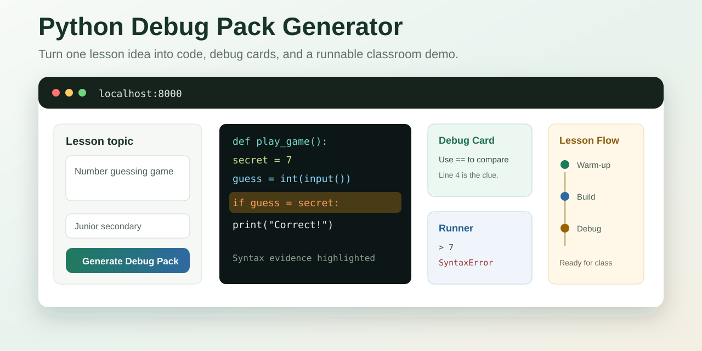

# Python Debug Pack Generator



An AI-assisted, one-page teacher demo for turning a Python lesson idea into a classroom-ready debugging pack. It generates a lesson flow, master code, starter code, intentionally buggy code, teacher debug cards, live model output, and a local interactive runner.

The UI starts in English by default unless the browser language is Chinese. Users can still switch language from the top bar.

## Highlights

- Browser-language aware English / Traditional Chinese UI
- Streaming lesson-pack generation from an OpenAI-compatible chat API
- Master, starter, and buggy Python code views with syntax highlighting
- Teacher debug cards that point to specific code evidence
- Local interactive Python runner for demoing inputs and runtime errors
- Fallback generation when no API key is configured

## Quick Start

```powershell
python -m venv .venv
.\.venv\Scripts\Activate.ps1
pip install -r requirements.txt
Copy-Item .env.example .env
uvicorn app.main:app --reload
```

Open `http://127.0.0.1:8000`.

## Configure A Model

The app talks to OpenAI-compatible `/chat/completions` endpoints. Copy `.env.example` to `.env`, then edit these values:

```text
DEEPSEEK_API_KEY=your_api_key_here
DEEPSEEK_BASE_URL=https://api.deepseek.com
DEEPSEEK_MODEL=deepseek-v4-flash
```

To use another OpenAI-compatible provider:

1. Set the provider's API key in `DEEPSEEK_API_KEY`.
2. Set `DEEPSEEK_BASE_URL` to the provider base URL, without `/chat/completions`.
3. Set `DEEPSEEK_MODEL` to that provider's model name.
4. Restart `uvicorn`.
5. Check `GET /api/status` or the status pill in the UI.

The variable names still use `DEEPSEEK_` because DeepSeek was the first provider used by this demo. Any provider that accepts OpenAI-style chat completions can be tried, but provider-specific options such as `thinking` and `reasoning_effort` may need code changes if the provider rejects them.

## API

- `GET /api/status`
- `POST /api/generate-pack`
- `POST /api/generate-pack/stream`
- `POST /api/run-session`
- `POST /api/explain-error`

The runner executes local demo code with a short timeout. Keep it on localhost; it is not a sandbox for untrusted public traffic.

## 中文說明

Python Debug Pack Generator 是一個給老師示範用的一頁式工具：輸入 Python 課堂主題後，它會生成教學流程、完整程式、學生起始程式、帶錯誤的程式、教師除錯卡、模型串流輸出，以及本機互動執行結果。

介面會根據瀏覽器語言自動選擇英文或繁體中文，也可以在右上角手動切換。

### 快速開始

```powershell
python -m venv .venv
.\.venv\Scripts\Activate.ps1
pip install -r requirements.txt
Copy-Item .env.example .env
uvicorn app.main:app --reload
```

打開 `http://127.0.0.1:8000`。

### 更換 OpenAI 相容模型

先把 `.env.example` 複製成 `.env`，再修改：

```text
DEEPSEEK_API_KEY=你的_api_key
DEEPSEEK_BASE_URL=https://供應商_base_url
DEEPSEEK_MODEL=模型名稱
```

如果供應商支援 OpenAI 風格的 `/chat/completions`，通常只要改 API key、base URL 和 model name，然後重新啟動 `uvicorn`。如果供應商不接受 `thinking` 或 `reasoning_effort` 之類的參數，則需要在 `app/generator.py` 調整請求 payload。

## License

No license is currently declared. Add one before allowing broad reuse.
