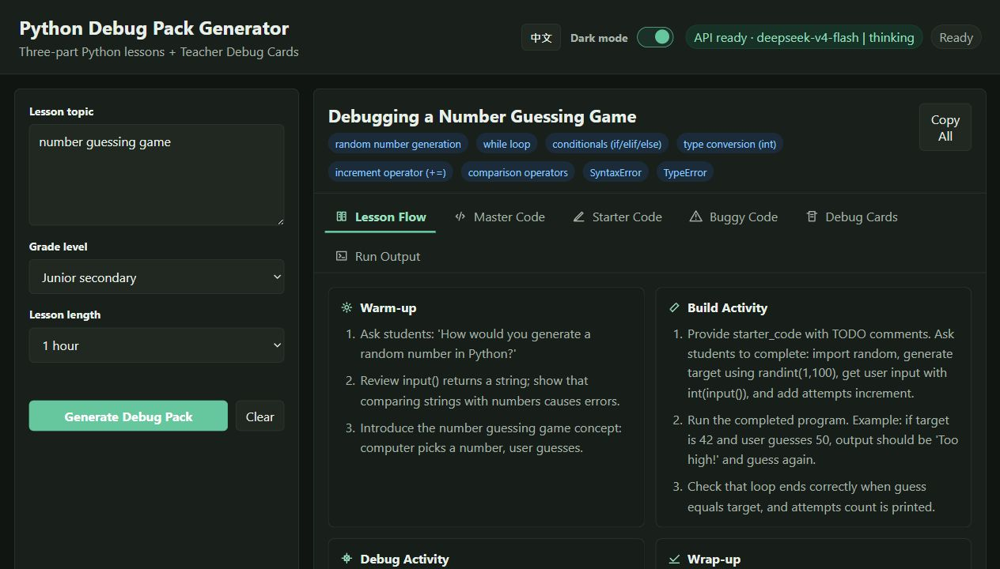
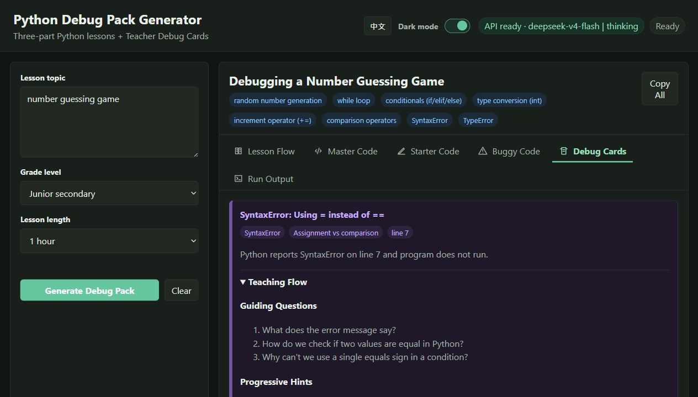
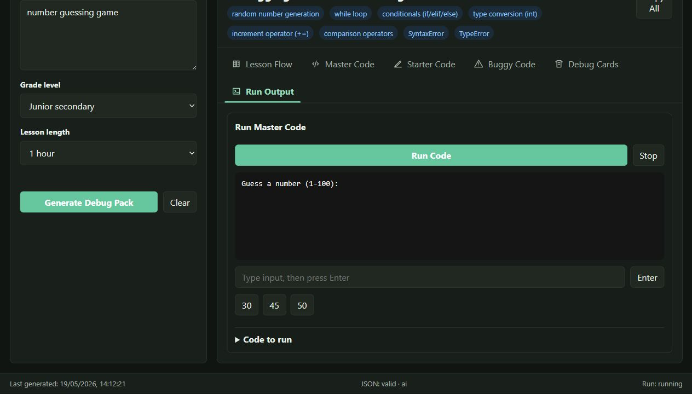

# Python Debug Pack Generator

[English](README.md) | **繁體中文**

Python Debug Pack Generator 是一個給老師示範用的一頁式工具：輸入 Python 課堂主題後，它會生成教學流程、完整程式、學生起始程式、帶錯誤的程式、教師除錯卡、模型串流輸出，以及本機互動執行結果。

以下圖片來自實際生成的教學包：

| 教學流程 | 教師除錯卡 | 互動執行器 |
| --- | --- | --- |
|  |  |  |

介面會根據瀏覽器語言自動選擇英文或繁體中文，也可以在右上角手動切換。

## 功能重點

- 根據瀏覽器語言自動選擇英文 / 繁體中文介面
- 使用 OpenAI 相容 Chat API 串流生成教學包
- 顯示完整程式、學生起始程式、錯誤程式，並有 Python 語法高亮
- 教師除錯卡會指向具體程式碼證據
- 本機互動 Python runner，可示範輸入和 runtime error
- 沒有 API key 時仍可使用 fallback 生成

## 快速開始

```powershell
python -m venv .venv
.\.venv\Scripts\Activate.ps1
pip install -r requirements.txt
Copy-Item .env.example .env
uvicorn app.main:app --reload
```

打開 `http://127.0.0.1:8000`。

## 更換 OpenAI 相容模型

此 app 會呼叫 OpenAI 相容的 `/chat/completions` endpoint。先把 `.env.example` 複製成 `.env`，再修改：

```text
DEEPSEEK_API_KEY=你的_api_key
DEEPSEEK_BASE_URL=https://供應商_base_url
DEEPSEEK_MODEL=模型名稱
```

更換其他 OpenAI 相容供應商時：

1. 把供應商 API key 填到 `DEEPSEEK_API_KEY`。
2. 把 `DEEPSEEK_BASE_URL` 改成供應商 base URL，不要包含 `/chat/completions`。
3. 把 `DEEPSEEK_MODEL` 改成該供應商的模型名稱。
4. 重新啟動 `uvicorn`。
5. 查看 `GET /api/status` 或 UI 右上角狀態。

環境變數仍叫 `DEEPSEEK_`，是因為這個 demo 最初使用 DeepSeek。只要供應商支援 OpenAI 風格的 chat completions，就可以嘗試接入；如果供應商不接受 `thinking` 或 `reasoning_effort` 等參數，需要在 `app/generator.py` 調整請求 payload。

## API

- `GET /api/status`
- `POST /api/generate-pack`
- `POST /api/generate-pack/stream`
- `POST /api/run-session`
- `POST /api/explain-error`

runner 會在本機執行 demo 程式，並有短 timeout。請只在 localhost 使用；它不是給公開網絡執行陌生程式碼的 sandbox。

## License

目前尚未宣告 license。若要讓其他人正式重用，請先加入合適的 license。
